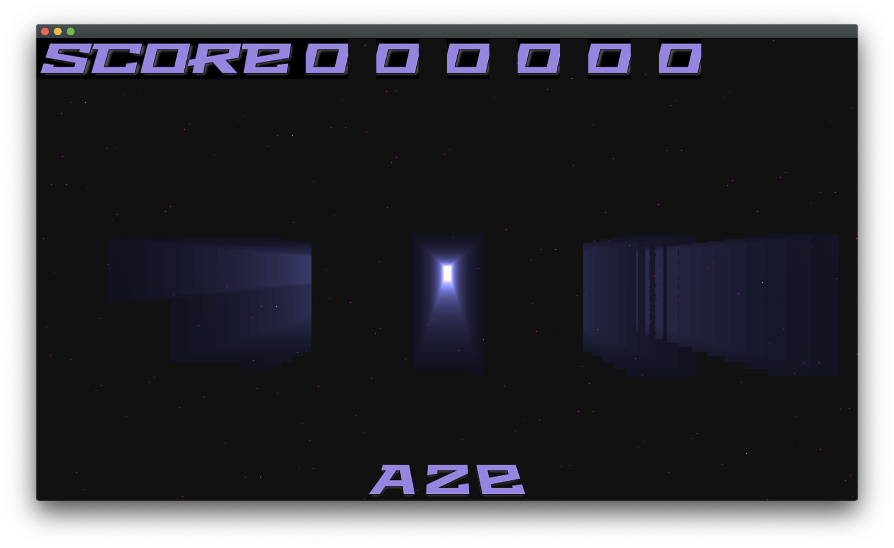
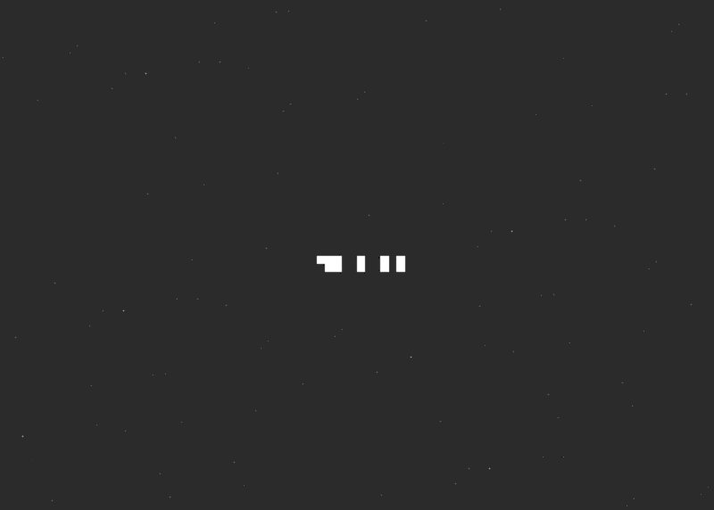

# VoxRay
Little game that use ray tracing and GPU power(OpenCL).

## Some render
The goal of this game is to combine shapes for that the final combined shape is a full rectangle.
To combine shapes click at the same time on two key. For example, if you want to combine the first and the second shape click simultaneously on A and Z. 

Cool effect

