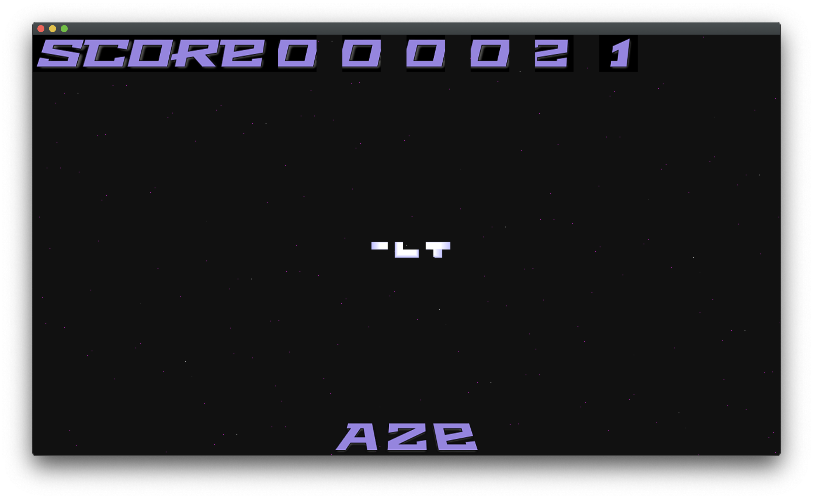
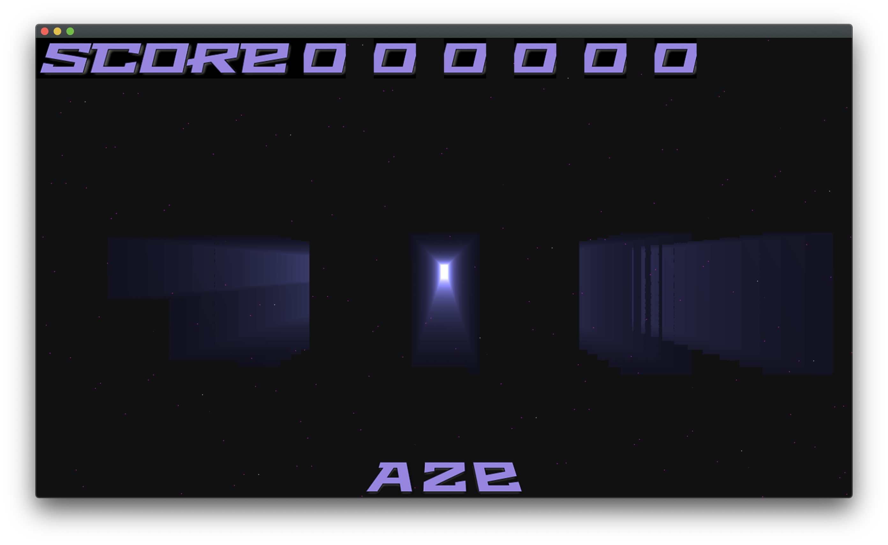
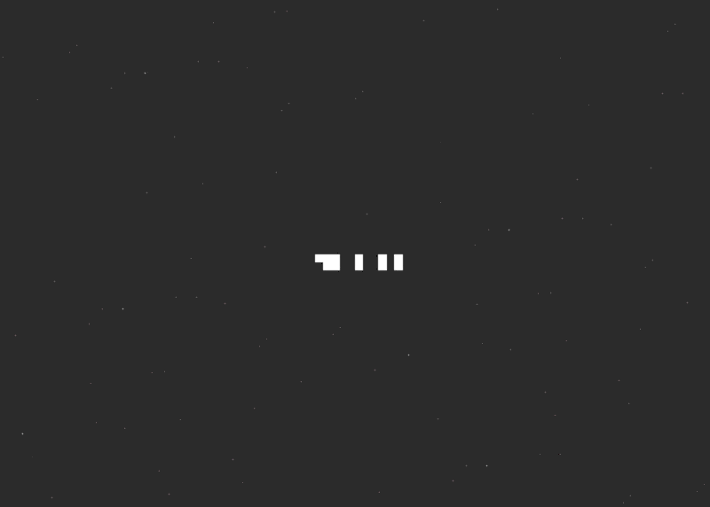

# VoxRay
[](https://github.com/Montfra/VoxRay/actions/workflows/build.yml)

Little game that use ray tracing and GPU power(OpenCL).

## Build
Requires a C++ compiler, [CMake](https://cmake.org/) (>= 3.13) and [SDL2](https://www.libsdl.org/) + an OpenCL SDK.

```bash
cmake -S . -B build -DCMAKE_BUILD_TYPE=Release
cmake --build build --config Release
```

The `VoxRay` executable is produced in `build/bin/` alongside `opencl_kernel.cl`, with the game's bitmaps copied to `build/ressources/`.

Prebuilt binaries for Linux, macOS and Windows are available as artifacts on the [Actions](https://github.com/Montfra/VoxRay/actions/workflows/build.yml) page for every build.

## Some render
The goal of this game is to combine shapes for that the final combined shape is a full rectangle.
To combine shapes click at the same time on two key. For example, if you want to combine the first and the second shape click simultaneously on A and Z. 

Cool effect


